# solidity_advanced_homework
"Crowdsale of PupperCoin token to fund network development."

### Purpose

In this project, we are using Smart Contracts to create our company's token (PupperCoin) and to set up a Crowdsale to raise funds for our network development. Our PupperCoinCrowdSale will run for 24 weeks, and will be a refundable crowdsale to enable refunds if our goal is met. Additionally, we will be limiting our raised funds to a cap of 300 Ether.

### The PupperCoin Contract

The `PupperCoin` contract is a standard `ERC20`, `ERC20Mintable` and `ERC20Detailed` contract. In order to bootstrap our contract with each of these token contracts' properties, we need to declare this.
```
contract PupperCoin is ERC20, ERC20Detailed, ERC20Mintable {
```

In the contract's `constructor` we are setting parameters for `name`, `symbol`, and `initial_supply`, all of which will be left with unassigned values to assign at contract deployment.
```
        string memory name,
        string memory symbol,
        uint initial_supply
```

Since `ERC20Detailed` requires  `name`, `symbol` and `decimals` parameters in its `constructor`, we need to call it from within our contract's `constructor`
```
    // ERC20Detailed constructor parameters
        ERC20Detailed(name, symbol, 18)
```

The body of the `constructor` can remain empty since all functions such as `mint`, `transfer`, `approve`, and `allowance` are inherited from the `ERC20` contracts.


### The PupperCoinCrowdSale Contract

The `PupperCoinCrowdSale` contract is a standard Crowdsale contract that inherits properties from the following `OpenZepellin` contracts: `Crowdsale`, `MintedCrowdsale`, `CappedCrowdsale`, `TimedCrowdsale`, and `RefundablePostDeliveryCrowdsale` so we need to declare this in our contract's creation.
```
contract PupperCoinCrowdSale is Crowdsale, MintedCrowdsale, CappedCrowdsale, TimedCrowdsale, RefundablePostDeliveryCrowdsale {
```
In the contract's `constructor` we need to enter parameters that are required for our standard `ERC20` and `Crowdsale` contracts. Since our `PupperCoin` contract is compatible with the `IERC20` interface that the `Crowdsale` contracts require, we can use it as our `token` object.
```
        string memory name,
        string memory symbol,
        address payable wallet,
        uint goal,
        uint cap,
        uint rate,
        uint openingTime,
        uint closingTime,
        PupperCoin token
```
We also need to call each contract's required `constructor` parameters inside our `constructor`.
```
        Crowdsale(rate, wallet, token)
        RefundableCrowdsale(goal)
        TimedCrowdsale(openingTime, closingTime)
        CappedCrowdsale(cap)
```
The body of the `constructor` can remain empty since all functions such as `buyTokens`, `claimRefund`, `withdrawTokens`, and `finalize` are inherited from the `Crowdsale` contracts.

### The PupperCoinCrowdSaleDeployer Contract

The `PupperCoinCrowdSaleDeployer` contract will enable us to deploy both, the `PupperCoin` and `PupperCoinCrowdSale` contracts from a single point.

We will need to fetch the deployed contracts' addresses, so we need to create variables for these.
```
    address public token_sale_address;
    address public token_address;
```

The Deployer contract's `constructor` will also need the sale contract's parameterers so they can be set at deployment.
```
        string memory name,
        string memory symbol,
        address payable wallet,
        uint goal,
        uint cap,
        uint rate,
        uint openingTime,
        uint closingTime,
        PupperCoin token
```
The Deployer will also need to pass the token and crowdsale contracts by defining new variables so that it can deploy them. The parameters for both contracts will need to be passed into the new variables as well. The `openingTime` and `closingTime` for the `PupperCoinCrowdSale` parameters can be changed to `now` and `now + 24 weeks`.
```
        PupperCoin token = new PupperCoin(name, symbol, 0);

        PupperCoinCrowdSale pupper_sale = new PupperCoinCrowdSale(name, symbol, wallet, goal, cap, rate, now, now + 24 weeks, token);
```
In order for the Deployer to store the token and crowdsale contract addresses, these will need to be assigned to the variables that we created at the start of the `PupperCoinCrowdSaleDeployer` contract.
```
        token_address = address(token);

        token_sale_address = address(pupper_sale);
```

Lastly, the minter role will need to be given back to the `PupperCoinCrowdSale` contract and renounced by the `PupperCoinCrowdSaleDeployer`  contract.
```
        token.addMinter(token_sale_address);
        token.renounceMinter();
```
### Deployment and Testing

Deploy the contract to your LocalHost first and test it by sending it Ether.
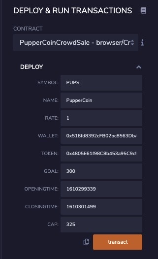
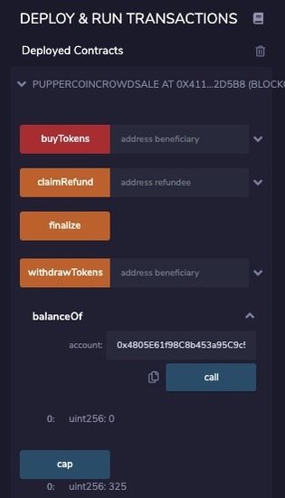
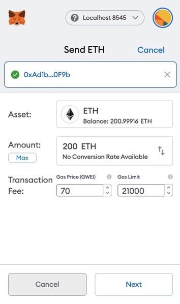
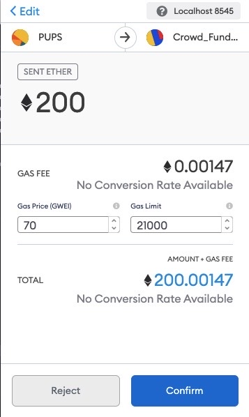

Connect the token to `MyCrypto` and test some transactions.
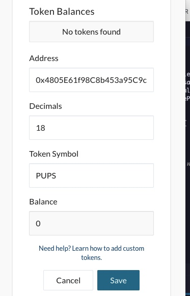
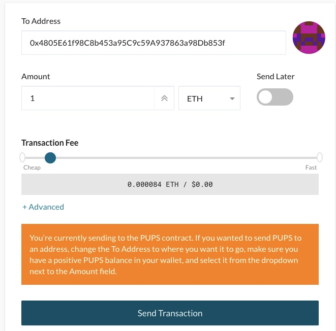

Deploy the contract to the `Kovan` testnet and test it by sending it Ether. Since Ether balances on the testnet are lower, reduce the `goal` and the `cap` before deploying.
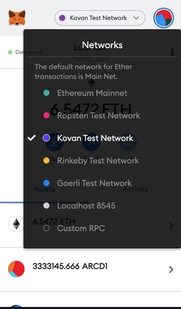
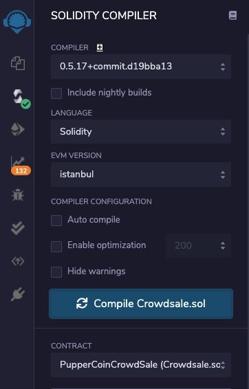
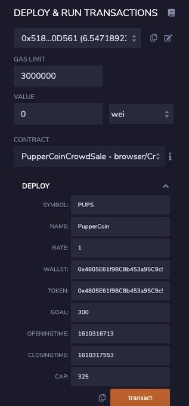
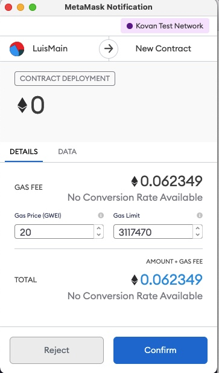
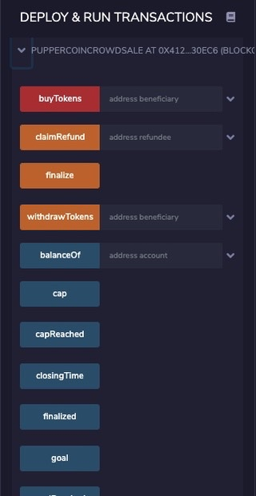
